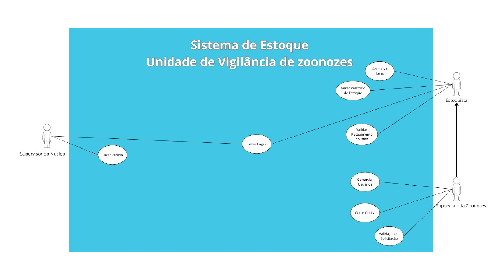

# Sistema de Estoque Zoonoses

## Histórias de Usuário

Supervisor da Zoonoses 

- Como supervisor da zoonoses, eu quero ter controle sobre os usuários que vão acessar o sistema.
- Como supervisor da zoonoses, eu quero fazer uma "crítica" para aqueles pedidos em caso de falta de estoque ou não ser conveniente com o local que o fez.
- Como supervisor da zoonoses, eu quero aprovar ou não um pedido.
- Como supervisor da zoonoses, eu quero ter acesso a todas as funcionalidades do estoquista.

Estoquista

- Como estoquista, quero fazer login no sistema para que eu posso acessar e controlar as operações de estoque.
- Como estoquista, quero gerenciar os itens cadastrados no sistema, como por exemplo remover ou cadastrar um novo item.
- Como estoquista, eu quero gerar um relátorio completo sobre o atual estoque.
- Como estoquista, eu quero validar o recebimento dos itens solicitados, para garantir que os materias foram entregue corretamente.

Supervisor dos Núcleo

- Como supevisor do núcleo, quero fazer login na plataforma para realizar os pedidos.
- Como supevisor do núcleo, quero fazer a solicitação de materias colocando os itens desejado e a quantidade.

## Diagrama de Uso

